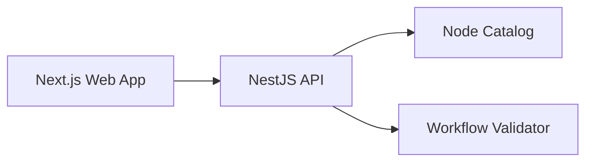

# FlowForge Architecture

## Product Shape

FlowForge is an AI workflow platform with four primary surfaces:

- Visual workflow editor for building automation graphs.
- Execution engine for running workflows reliably in the background.
- AI layer for LLM calls, agents, tool calling, and RAG.
- Work management layer for tasks, projects, comments, and notifications.

## Planned Runtime Components

- `apps/api`: NestJS API, workflow management, auth, task management, realtime gateway.
- `apps/web`: Next.js browser application and workflow canvas.
- `apps/worker`: background execution runner powered by BullMQ.
- `packages/workflow-core`: workflow graph types, validation, execution primitives.
- `packages/mcp-server`: MCP interface that lets external assistants call FlowForge tools.

The first milestone colocates the domain logic inside `apps/api`. When execution arrives, shared workflow logic can move into `packages/workflow-core`.

## Workflow Model

A workflow is a directed graph:

- `nodes`: typed units such as webhook, LLM, decision, task creation, Telegram notification.
- `edges`: transitions from one node output to another node input.
- `metadata`: name, version, status, owner, timestamps.

Validation rules in the first milestone:

- workflow must have a non-empty name;
- node IDs must be unique;
- node types must exist in the catalog;
- edges must point to existing nodes;
- graph must not contain cycles.

Future validation will add typed ports, secrets requirements, JSON schema for node config, and execution-specific constraints.

## First Vertical Slice

The first implemented slice is intentionally small:

This gives us a runnable foundation while keeping the next steps clear.
