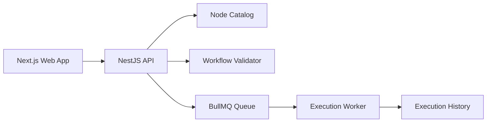

# FlowForge Architecture

## Product Shape

FlowForge is an AI workflow platform with four primary surfaces:

- Visual workflow editor for building automation graphs.
- Execution engine for running workflows reliably in the background.
- AI layer for LLM calls, agents, tool calling, and RAG.
- Work management layer for tasks, projects, comments, and notifications.

## Planned Runtime Components

- `apps/api`: NestJS API, workflow management, auth, task management, realtime gateway.
- `apps/web`: Next.js browser application and workflow canvas.
- `apps/worker`: background execution runner powered by BullMQ and Redis.
- `packages/workflow-core`: workflow graph types, validation, execution primitives.
- `packages/mcp-server`: MCP interface that lets external assistants call FlowForge tools.

The first milestone colocates the domain logic inside `apps/api`. When execution arrives, shared workflow logic can move into `packages/workflow-core`.

## Workflow Model

A workflow is a directed graph:

- `nodes`: typed units such as webhook, LLM, decision, task creation, Telegram notification.
- `edges`: transitions from one node output to another node input. Decision nodes can select an output port to activate only the matching branch.
- `metadata`: name, version, status, owner, timestamps.

Validation rules in the first milestone:

- workflow must have a non-empty name;
- node IDs must be unique;
- node types must exist in the catalog;
- edges must point to existing nodes;
- graph must not contain cycles.

Future validation will add typed ports, secrets requirements, JSON schema for node config, and execution-specific constraints.

## First Vertical Slice

The first implemented slice is intentionally small:

This gives us a runnable foundation while keeping the next steps clear.

## Execution Model

The worker runs a workflow by sorting the graph, activating start nodes, executing each active node through a handler registry, applying per-node retry and timeout policy, and storing node-level input/output history.

Current handlers are deterministic stubs for the first product slice:

- triggers and sources normalize incoming execution input;
- transform nodes pass extracted text forward;
- LLM nodes return a local placeholder response;
- decision nodes select an output port;
- task and notification nodes return simulated delivery records.

Real external integrations will replace these stubs behind the same handler contract.

Node runtime policy is configured on each node:

- `config.timeoutMs`: maximum runtime for one attempt;
- `config.retry.maxAttempts`: total attempts before the node fails;
- `config.retry.delayMs`: delay between failed attempts.

## AI Layer

LLM execution is behind an `LlmProvider` contract. The default implementation is a deterministic local provider so development, tests, and Docker startup do not require external API keys.

The worker switches to the OpenAI Responses API provider when `OPENAI_API_KEY` is configured. The provider posts typed developer and user messages to `/responses`, reads `output_text` or nested `output_text` message content, and records model/provider/token usage in node output.

Streaming is exposed through the same provider contract as an async event stream. The first streaming node stores collected chunks in execution history; Phase 5 will forward those deltas to the editor over WebSocket.

Tool calling uses a separate `ToolRegistry` contract. The first tools are deterministic FlowForge actions such as `createTask` and `searchUsers`, and the `ai.toolCall` node executes registered tools with structured arguments. This same registry is the planned source of truth for MCP-exposed tools.

Agents use an `AgentRegistry` contract. The first registered agent is `taskBreakdown`, which asks the configured LLM provider for structured subtasks and falls back to deterministic subtasks if the model returns non-JSON text. The `ai.agent` node runs agents with task input and stores the agent result in execution history.

Additional providers such as Anthropic can be added as separate implementations without changing the workflow runner or node handler contract.

## Realtime Layer

Workflow execution emits lifecycle events for execution and node state changes. The worker publishes those events to Redis pub/sub, and the NestJS API subscribes through a WebSocket gateway.

Clients connect to the `/executions` Socket.IO namespace, subscribe to an execution ID, and receive `execution.event` payloads for that execution room.
